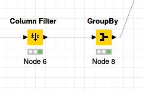

Muhammad Adistya Azhar

05111640000103

Big Data

# ETL menggunakan Knime

## Penjelasan Dataset
Dataset yang saya gunakan adalah Crimes in Boston (https://www.kaggle.com/AnalyzeBoston/crimes-in-boston). Dataset ini terdiri dari 2 table. Table tersebut adalah *offence_codes* dan *crime*. Table *offence_codes* berisi tipe kejahatan yang direpresentasikan dalam bentuk kode. Table *crime* berisi kejahatan yang telah dilaporkan ke polisi daerah Boston. Total jumlah baris yang ada pada table *offence_codes* adalah 576, dan *crime* memiliki 319 073.

Table *offence_codes* memiliki 2 kolom, yaitu: *code* yang merupakan kode dan *name* yang merupakan deskripsi kejahatan. Selanjutnya, table *crime* memiliki 17 kolom, yaitu: 
- *incident_number*: merepresentasikan *identifier* laporan kejahatan
- *offense_code*: merupakan kode tipe kejahatan dan berhubungan dengan table *offence_codes*
- *offence_code_group*: merupakan kode tipe kejahatan secara umum
- *offence_description*: merupakan deskripsi kejahatan
- *district*: merupakan daerah district terjadinya kejahatan
- *reporting_area*: merupakan kode area terjadinya kejahatan
- *shooting*: memiliki arti apakah kejahatan yang dilaporkan terjadi penembakan
- *occured_on_date*: merupakan tanggal terjadinya kejahatan
- *year*: merupakan tahun terjadinya kejahatan
- *month*: merupakan bulan terjadinya kejahatan
- *day_of_week*: merupakan hari terjadinya kejahatan
- *hour*: merupakan jam terjadinya kejahatan
- *ucr_part*: merupakan kode kejahatan yang telah terdefinisi oleh Uniform Crime Reports (https://www.ucrdatatool.gov/offenses.cfm)
- *street*: lokasi jalan terjadinya kejahatan
- *lat*: latitude terjadinya kejahatan
- *long*: longitude terjadinya kejahatan
- *location*: latitude dan longitude terjadinya kejahatan

## Business Understanding Dataset Crimes in Boston
Dataset yang digunakan sangat bermanfaat bagi instansi keamanan dan pemerintah. Dengan adanya history laporan kejahatan, dapat diambil kesimpulan seperti:
1. Daerah mana yang sering terjadi kejahatan
2. Pada pukul berapa yang sangat berbahaya
3. Tipe kejahatan yang sering muncul

## Data Preparation
Dataset yang digunakan sudah terpisah menjadi 2 file. Saya menggunakan file *offense_codes.csv* untuk diimport ke database MySQL. File satunya adalah *crime.csv* dan file tersebut akan menjadi data source dalam bentuk *.csv*.

#### Steps
1. Membuat table MySQL untuk mengakomodir *offense_codes*. 

``
create table bdt_01.offence_codes
(
	code int not null,
	name varchar(1000) null
);
``
2. Import data dari csv ke table *offence_codes*. Dapat menggunakan script atau tools. Saya menggunakan fitur import dari aplikasi Datagrip.

3. Cek bahwa data berhasil diimport.

``
select * from offence_codes;
``

## Modeling
Proses membaca data dari 2 sumber dilakukan dengan menggunakan *node* IO Read dan DB Connection. 

Pada ujicoba kali ini menggunakan CSV Reader dan MySQL Connector. 

Konfigurasi node MySQL Connector adalah sebagai berikut:
- Hostname: localhost
- Database name: bdt_01
- Port: 3306

Konfigurasi node CSV Reader adalah sebagai berikut:
- Input location: /home/adis/Downloads/crimes-in-boston/crime.csv
- Has Column Header checked
- Has Row Header unchecked

Setelah konfigurasi node CSV Reader selesai, maka tekan tombol Execute.

Berikut adalah data yang terbaca oleh node CSV Reader:
 

Selanjutnya adalah memilih table asal data yang tersimpan di MySQL. Dapat menggunakan node DB Table Selector. Sambungkan output dari node MySQL Connector ke input node DB Table Selector.

Konfigurasi node DB Table Selector adalah sebagai berikut:
- Schema: bdt_01
- Table: offence_codes
- SQL Statement: ``SELECT * FROM #table# LIMIT 1000``

Tekan tombol Execute jika konfigurasi sudah selesai.

Selanjutnya adalah untuk mengeksekusi query yang dicatat pada node DB Table Selector, dengan cara menggunakan node DB Reader. Sambungkan output dari node DB Table Selector menuju input node DB Reader. Node DB Reader menggunakan konfigurasi default, sehingga kita tidak perlu setting lebih lanjut.

 
 
 Tekan tombol Execute pada node DB Reader. Berikut adalah hasilnya:
 
  

 Tahap membaca data dari sumber yang berbeda sudah berhasil dilakukan. Berikutnya adalah untuk melakukan *join* dari dua sumber data. Prosedur tersebut dapat dimulai dengan menggunakan node Joiner. 
 
 Fungsi node Joiner adalah untuk melakukan operasi *join* dari sumber data yang kita pilih. Caranya adalah dengan memilih kolom dari ke 2 sumber sebagai kolom yang memiliki relasi. Sambungkan output dari node DB Reader dan output dari node CSV Reader ke input node Joiner.

 

 Konfigurasi node Joiner adalah sebagai berikut:
 - Top Input: code
 - Bottom Input: OFFENSE_CODE
 

Berikut adalah hasil operasi join:

Dapat dilihat bahwa ada beberapa kolom yang tidak dibutuhkan. Oleh karena itu, kita bisa memilih kolom apa saja yang ingin disimpan, menggunakan node Column Filter. Sambungkan output dari node Joiner ke input node Column Filter.

Berikut adalah konfigurasi node Column Filter:

Berikut adalah hasil eksekusi node Column Filter:

Pada tahap ini, saya ingin mengetahui jumlah laporan kejahatan yang terjadi pada setiap district. Untuk mendapatkan informasi itu, dapat menggunakan node GroupBy, yang akan melakukan agregasi data. Sambungkan output dari node Column Filter ke input node GroupBy.

Konfigurasi node GroupBy:
- Kolom yang digunakan untuk operasi group: name dan DISTRICT

    
- Kolom yang digunakan untuk operasi count: INCIDENT_NUMBER

    

Hasil eksekusi node GroupBy:

## Evaluation

Pada tahap ini, dapat disimpulkan bahwa proses join berhasil.

## Deployment

Tahap terkahir adalah menyimpan hasil join ke file dan database. Dapat menggunakan node CSV Writer dan node DB Writer. Sambungkan output node GroupBy ke input node CSV Writer dan node DB Writer, dan output node MySQL Connector ke input node DB Writer.

Konfigurasi node CSV Writer:

Konfigurasi node DB Writer:

Hasil akhir:

- File CSV

    
    
- DB

    ``select * from joined;``
 
    
    
- Workflow

    